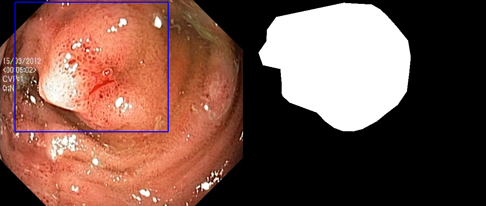
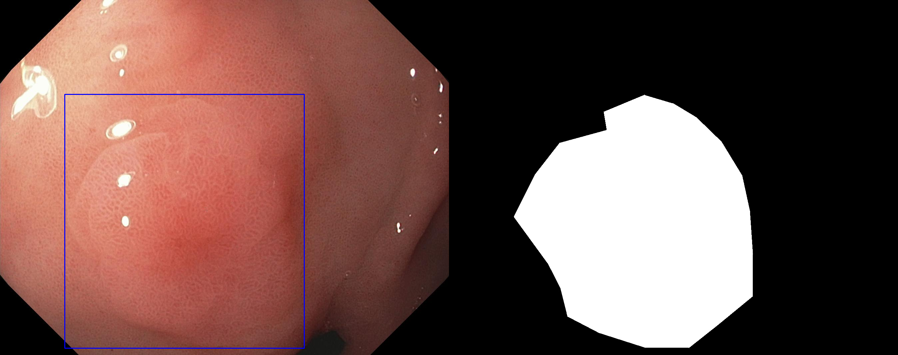
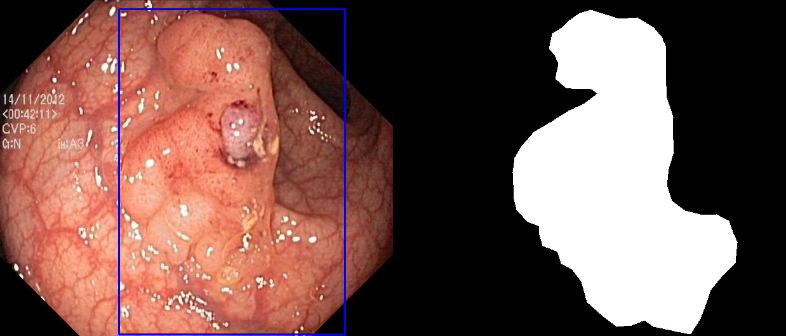
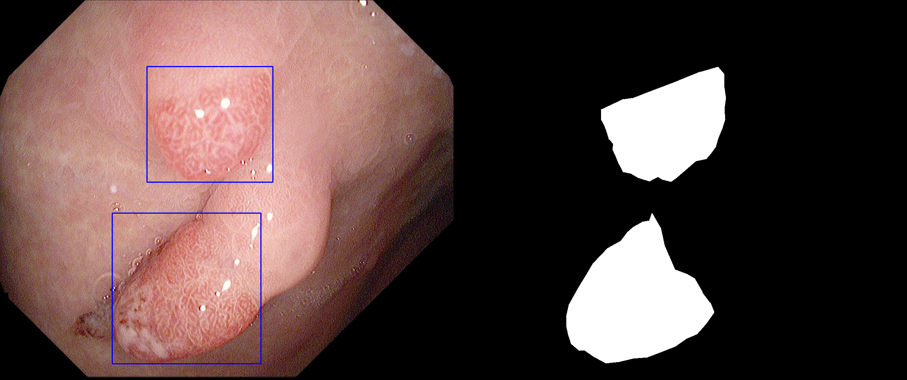

# Semantic-Segmentation-Mask-to-Bounding-Box
This repository contains the code for extracting bounding box coordinates from a binary segmentation mask.

## Dataset
Download the Kavsir-SEG from here: [https://datasets.simula.no/kvasir-seg/](https://datasets.simula.no/kvasir-seg/)

## Results
The images with the bounding box coordinates plotted on the image along with the binary mask.

|  |
| :--: |
|  |
|  |
|  |

## Contact
For any query contact below:
- [Facebook](https://www.facebook.com/idiotdeveloper)
- [Instagram](https://www.instagram.com/nikhilroxtomar/)
- [Telegram](https://t.me/idiotdeveloper)
